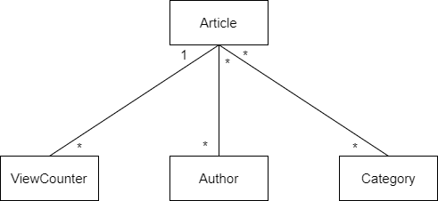

# Dokumentaatio #

## Kuvaus

Sovellus on geneerinen uutissivu, jonka ulkoasu on hieman erään suuren suomalaisen lehden inspiroima.

Sovelluksessa on kaksi sivua: artikkelilista-sivu ja artikkeli-sivu. Artikkelilista-sivu näyttää listan artikkeleista käyttäjän valitseman kategorian perusteella. Artikkeli-sivulla pääsee lukemaan koko artikkelin ja näkee sivupalkin, jossa on lista uusista ja suosituista artikkeleista.

Lisäksi sovelluksessa on admin-osio, josta voidaan luoda kategorioita, kirjoittajia ja artikkeleita.

## Käyttötapaukset ja käyttöohjeet

### Artikkeleiden listaus kategorian perusteella

Sivun yläosassa, logon alapuolella, on lista kategorioista, joista klikkaamalla näkee listan kyseisen kategorian artikkeleista. Sovelluksessa on myös kaksi "meta" kategoriaa: uusimmat ja suositut uutiset.

### Uusimpien artikkeleiden listaus

Listan uusimmista artikkeleista löytää `Uusimmat` kategorian alapuolelta. Lisäksi tämä lista näkyy myös yksittäisen artikkelin sivupalkissa.

### Suosituimpien artikkeleiden listaus

Listan suosituimmista artikkeleista löytää `Suositut` kategorian alapuolelta. Lisäksi tämä lista näkyy myös yksittäisen artikkelin sivupalkissa.

### Artikkelin lukeminen

Klikkaamalla artikkelia lista-näkymässä pääsee lukemaan koko artikkelin ja näkemään siitä lisää tietoa.

### Artikkeleiden luonti

Klikkaamalla etusivulla oikeassa yläkulmassa olevaa `Admin portal` nappulaa pääsee admin työkaluun, josta voi hallita artikkeleita ja muita resursseja.

## Toteuttamattomat ominaisuudet

- Artikkeleiden järjestämisen kategorian ja katseluiden perusteella jätin toteuttamatta, sillä tehtävänannosta jäi hieman epäselväksi, oliko se tarpeellista vai ei.

- Admin puolella ei ole muokkaus tai poisto mahdollisuutta

- Virheviestejä ei muotoilla mitenkään

## Parannusehdotuksia

- Sovellus pitää kirjaa artikkeleiden viimeisen 7 päivän katseluista tallentamalla jokaista päivää kohtaan rivin `ViewCounter` tauluun. Jos katselutilastoista halutaan tarkastella vain viimeisen 7 päivän tilastoja, voitaisiin sitä vanhemmat tilastot poistaa säännöllisin väliajoin, jolloin tietokantakyselyt nopeutuisivat.

- Thymeleaf templatet sisältävät copy-pastea, koska en käyttänyt fragmentteja

## Asennusohje

1. `git clone https://github.com/khugo2/news.git`
2. Install maven
3. `mvn spring-boot:run`

## Tietokantamalli

Taulujen kentät löytyvät [modeleista](https://github.com/khugo2/news/tree/master/src/main/java/news/domain).
